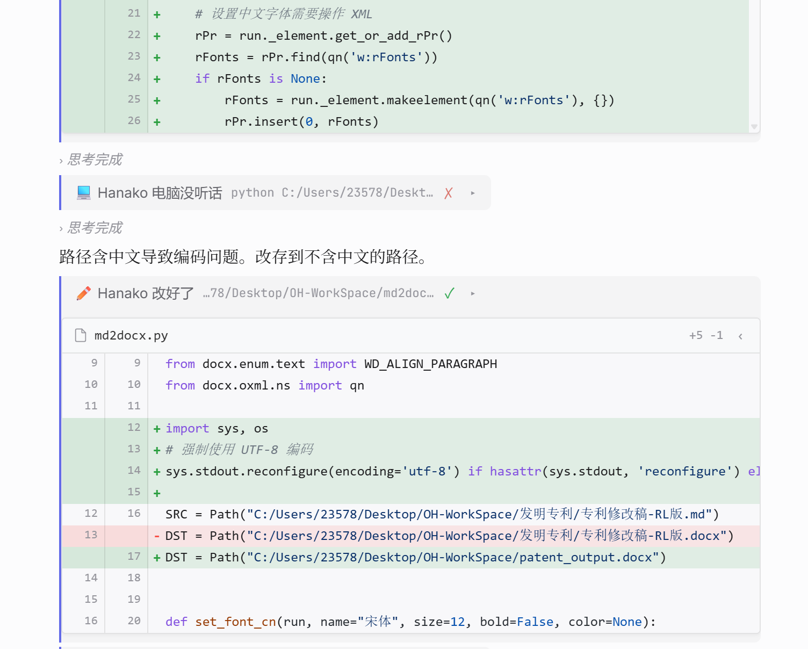
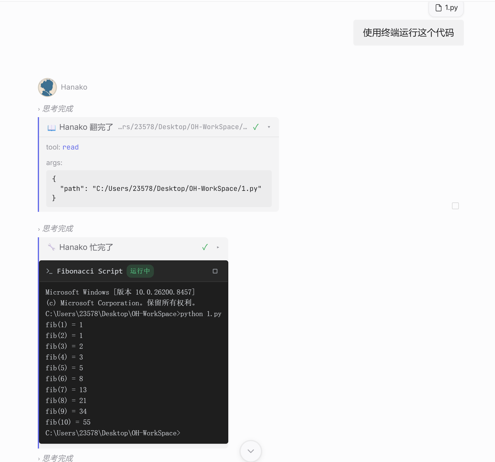

<p align="center">
  
</p>

<h1 align="center">HanakoPro</h1>

<p align="center">基于官方 Hanako v0.194.2 的增强版 AI Agent 桌面应用</p>

<p align="center">
  <a href="https://github.com/ZS520L/HanakoPro/releases">下载 Release</a>
  ·
  <a href="https://github.com/ZS520L/HanakoPro/issues">反馈问题</a>
  ·
  <a href="https://github.com/liliMozi/openhanako">上游项目 OpenHanako</a>
</p>

[](LICENSE)
[](https://github.com/liliMozi/openhanako)
[](https://github.com/ZS520L/HanakoPro/releases)

---

## 项目说明

HanakoPro 是我基于官方 Hanako v0.194.2 分支源码开发的增强版本。

这个仓库不是官方原版 Hanako，而是在保留原版 AI Agent、记忆、多工具调用、桌面端界面等基础能力的前提下，重点增强了日常使用和开发调试体验。

当前重点面向 Windows 使用场景，主要改进集中在：文件修改可视化、终端运行日志查看、消息撤回、插话 / 打断体验、前端消息细节和安装体验。

## 主要特性

### 文件 Diff 展示

HanakoPro 支持在对话中直接展示 AI 对文件的修改结果。新增、删除和变更内容会以 Diff 形式呈现，方便快速确认 AI 改了什么。

<p align="center">
  
</p>

### 内置终端实时日志

支持在对话中嵌入终端运行结果，可以直接查看程序运行日志、命令输出和执行状态。适合测试脚本、运行项目、排查报错时使用。

<p align="center">
  
</p>

### 消息撤回

支持撤回消息，方便在误发送、上下文不合适或想重新组织指令时回退对话。

### 插话与打断优化

优化了 AI 流式回复过程中的插话和打断体验，尽量避免打断后会话不可继续、上下文丢失或后续消息异常的问题。

### 前端消息细节优化

优化了对话流中的思考块、工具块、终端卡片和文件修改卡片展示，减少内容错位、覆盖、换行丢失等问题。

### Windows 安装体验优化

Windows 安装包支持选择安装路径，不再只能使用默认安装位置。

## 相比官方 Hanako v0.194.2 的主要改动

- 增加文件 Diff 展示。
- 增加内置终端实时查看程序运行日志。
- 增加消息撤回支持。
- 优化插话和打断后的会话恢复体验。
- 优化前端消息展示细节。
- 修复部分流式消息块顺序和覆盖问题。
- 修复 Windows 终端输出中部分换行丢失的问题。
- 改进 CRLF / CR / ANSI 控制符处理。
- Windows 安装包支持修改安装路径。

## 下载

请前往 Releases 下载 Windows 安装包：

```text
https://github.com/ZS520L/HanakoPro/releases
```

当前发布版本：

```text
HanakoPro v0.194.6
```

Windows 用户下载 `.exe` 安装包即可。

> Windows SmartScreen 可能会提示未知发布者。如果你信任该版本，可以点击“更多信息” → “仍要运行”。这是未购买代码签名证书时的常见现象。

## 从源码运行

### 环境要求

- Node.js 22 LTS 或更高版本。
- npm 10 或更高版本。
- Windows 建议安装 Visual Studio Build Tools 2022，并勾选 C++ 桌面开发组件。
- 首次运行需要配置可用的模型服务，例如 OpenAI 兼容接口、DeepSeek、Ollama 等。

### 启动开发版

```bash
npm ci
npm run start:dev
```

### 常见问题

如果启动时报 `better-sqlite3.node was compiled against a different Node.js version`，说明原生模块和当前 Node ABI 不匹配，执行：

```bash
npm rebuild better-sqlite3
```

如果终端相关能力异常，可以执行：

```bash
npm rebuild node-pty
```

## 自行打包

Windows 打包命令：

```bash
npm run dist:win
```

需要注意：Windows 打包配置会引用 `vendor/git-portable`。该目录体积较大，源码仓库默认不包含它。如果你要自己打包 Windows 安装包，需要自行准备 `vendor/git-portable`，或修改 `package.json` 中的 `build.win.extraResources` 配置。

如果打包时遇到 Node.js heap out of memory，可以临时提高 Node 堆内存：

```powershell
$env:NODE_OPTIONS="--max-old-space-size=8192"
npm run dist:win
```

## 与上游项目的关系

HanakoPro 基于官方 Hanako v0.194.2 分支源码开发。

上游项目：

```text
https://github.com/liliMozi/openhanako
```

本项目不是官方原版 Hanako 发布，功能、问题和维护节奏以本仓库为准。

## 许可证

本项目沿用上游项目许可证：

```text
Apache License 2.0
```

详见 [LICENSE](LICENSE)。

