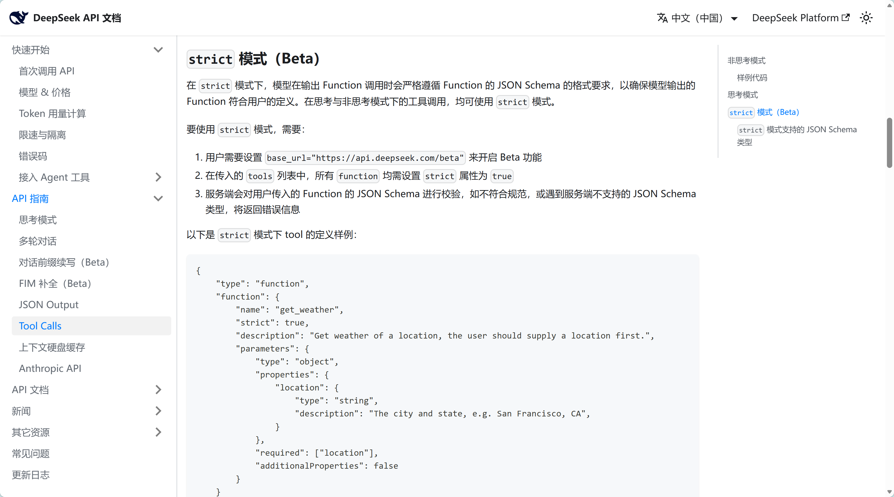
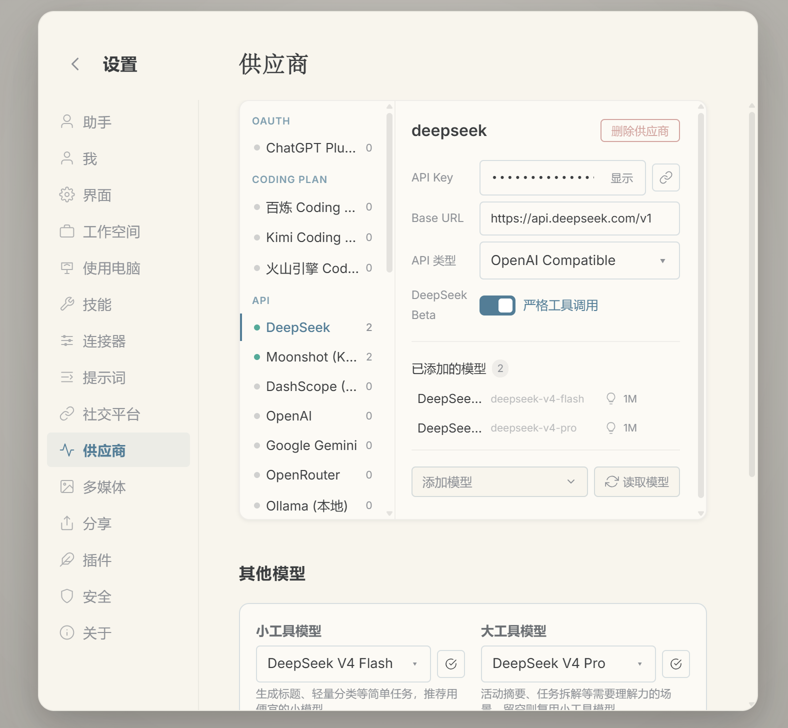
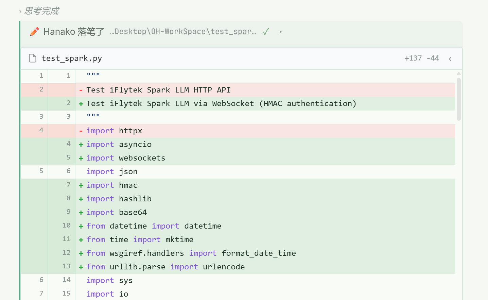
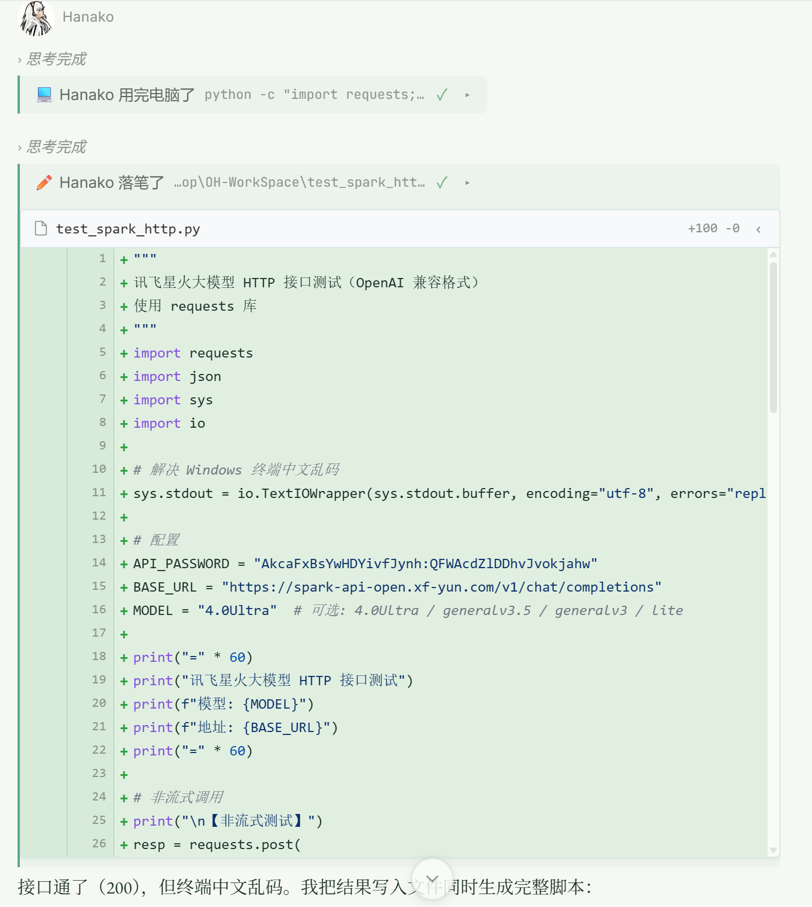
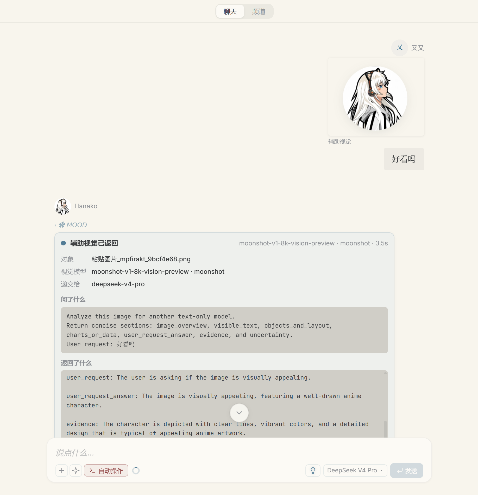
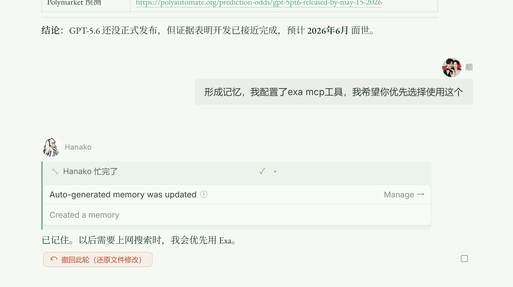
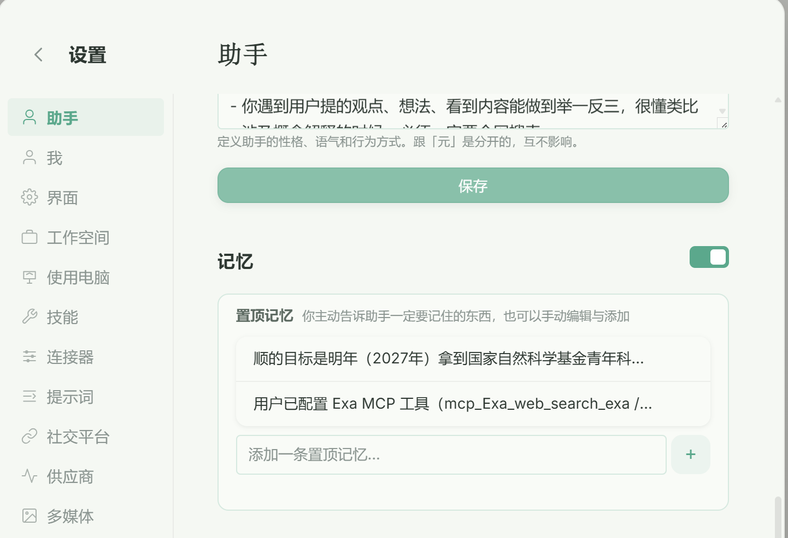
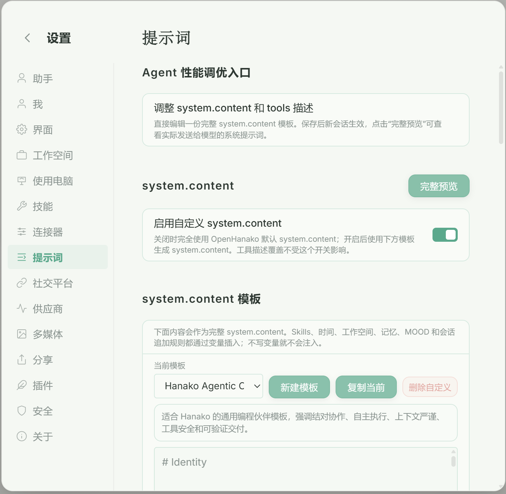
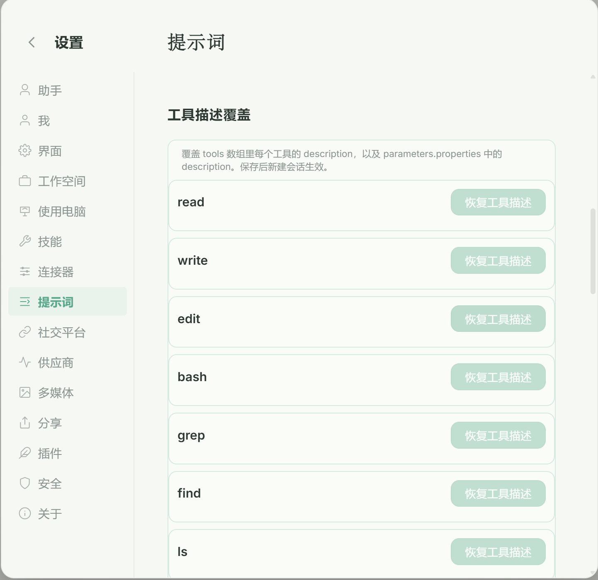
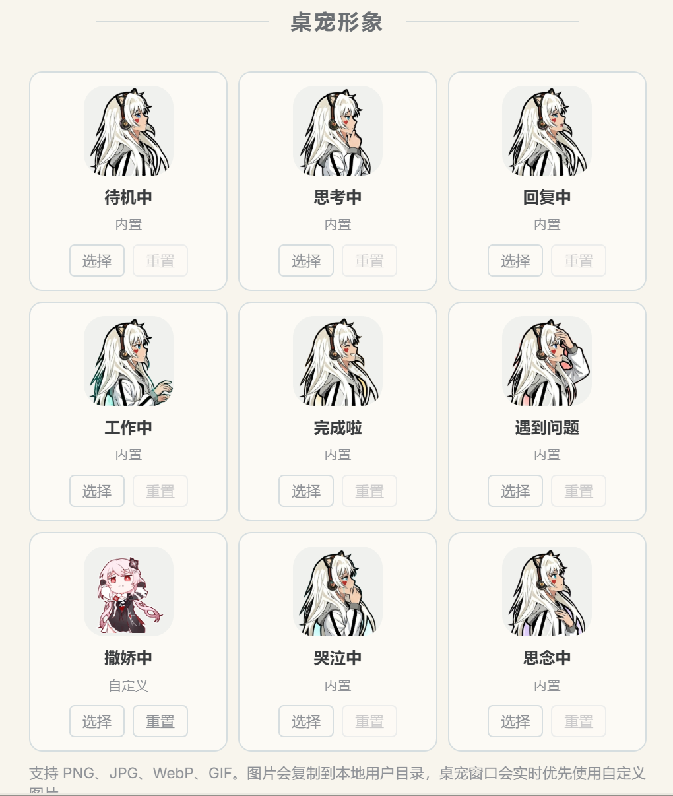

<h1 align="center">HanakoPro</h1>

<p align="center">基于官方 Hanako v0.194.2 的增强版 AI Agent 桌面应用</p>

<p align="center">
  <a href="https://github.com/ZS520L/HanakoPro/releases">下载 Release</a>
  ·
  <a href="https://github.com/ZS520L/HanakoPro/issues">反馈问题</a>
  ·
  <a href="https://github.com/liliMozi/openhanako">上游项目 OpenHanako</a>
</p>

<p align="center">
  <a href="LICENSE"></a>
  <a href="https://github.com/liliMozi/openhanako"></a>
  <a href="https://github.com/ZS520L/HanakoPro/releases"></a>
</p>

---

# 项目说明

HanakoPro 是我基于官方 Hanako v0.194.2 分支源码开发的增强版本。

这个仓库不是官方原版 Hanako，而是在保留原版 AI Agent、多工具调用、桌面端界面等基础能力的前提下，重点增强了日常使用和开发调试体验。

当前重点面向 Windows 使用场景，主要改进集中在：文件修改可视化、终端运行日志查看、消息撤回、插话 / 打断体验、记忆系统、系统提示词与工具描述自定义、桌宠以及前端消息展示细节。

# Vibe Coding 实践与 Agent 本质思考

## 一、Vibe Coding 体验

**Vibe Coding** 是一种沉浸式编程范式：开发者只需关注最终效果，无需关注实现细节，代码生成与调整全部交由 AI 完成。

本次二次开发全程采用 Vibe Coding，未手动修改一行代码。令人意外的是，即便在这种"只动口不动手"的模式下，仍然学到了很多东西。以下分享一些观察：

### 人的定位：需求提出者 + 验收者

Vibe Coding 中，人的角色并没有消失，而是上移到了两个关键环节：

1. **提需求**：既需要精准捕捉使用痛点，又需要能够清晰描述。我的提示词没有特殊设计，也未做二次优化，长度一般在 50 字左右，复杂场景可到 500 字。原则就一条：**把需求描述清楚**。
2. **验收**：判断生成结果是否满足预期，发现偏差并指出修正方向。

### 案例：上下文压缩功能的需求描述

以"上下文压缩"功能为例，一次合格的需求描述需要覆盖以下维度：

| 维度 | 需要说明的内容 |
|---|---|
| **前端·设置页** | 控件类型、布局样式、交互文案 |
| **后端逻辑** | 报文如何处理、压缩策略 |
| **交互流程** | 点击压缩后触发什么逻辑、状态如何流转 |
| **前端表现** | 压缩过程中 UI 反馈、完成后结果展示 |
| **测试验证** | 如何确认压缩效果符合预期 |

可以看到，对需求提出者的要求并不低。**Vibe Coding 降低的是编码门槛，而非思考门槛**。

### 核心收获

最关键的一点：**不再关注代码细节后，反而有更多精力去触碰更本质的东西。** 当实现层面的噪音被屏蔽，人的注意力自然转向架构、交互逻辑和设计意图。当然，这或许和个人的思考习惯有关，但方向值得关注。

---

## 二、对 Agent 的祛魅

### 本质不过是一段 HTTP 请求

下面是一段 DeepSeek 兼容 OpenAI 格式的完整请求报文：

```json
{
  "model": "deepseek-v4-pro",
  "messages": [
    {
      "role": "system",
      "content": "You are running on the OpenHanako platform, ..."
    },
    {
      "role": "user",
      "content": [
        {
          "type": "text",
          "text": "你好"
        }
      ]
    }
  ],
  "stream": true,
  "stream_options": {
    "include_usage": true
  },
  "store": false,
  "tools": [
    {
      "type": "function",
      "function": {
        "name": "read",
        "description": "Read the contents of a file...",
        "parameters": { ... }
      }
    }
  ]
}
```

这就是最本质的东西。无论前端是 Agent IDE 还是 CLI 终端，无论界面多么丰富美观，无论系统架构多么复杂，后端最终做的事情只有一件：**整理上下文，拼接成一次 API 请求，发送给模型**。

那么，不同 Agent 产品之间的效果差异究竟来自哪里？答案落在两个关键变量上：

### 关键变量一：System Prompt（系统提示词）

系统提示词在很大程度上决定了后续 Assistant 回复的风格、语气和行为倾向。可以说，**整个对话上下文的基调和边界，是由系统提示词划定的。**

原因在于：用户的问题是千人千面的，无法预测；Assistant 的回复是模型生成的，无法直接修改。唯一可控的注入点，就是 System Prompt。

因此，Pro 版本专门支持用户自定义系统提示词。**这是最大的亮点，据我所知，目前还没有其他产品这样做。**

### 关键变量二：Tools（工具列表）

工具能力直接决定了 Agent 的上限。一个直观的体验：OpenHanako 内置的 `web_search` 搜索能力有限，导致 Agent 反复调用工具却最终告知"没有完成任务"。DeepSeek 在 strict 模式下工具调用本身很稳定，但如果工具返回的结果质量不行，再稳定的调用也无济于事。

工具链的质量，就是 Agent 能力的天花板。

### Skills 与 MCP 的底层机制

- **Skills 的相关信息** 是拼接到系统提示词中发送给模型的。本质上，Skills 是对 System Prompt 的结构化扩展，用于注入领域知识和行为规范。
- **MCP 的工具列表** 则是放入 Tools 数组中发送的。MCP 扩展的是 Agent 的行动边界，而非思维边界。

理解这两条路径的差异，就理解了 Agent 框架的核心设计：**System Prompt 管"怎么想"，Tools 管"怎么做"。**

### 关于记忆机制的再思考

记忆同样是拼接到系统提示词中注入上下文的。

这里和原版的理念有分歧。原版强调"让用户感知不到 AI 的记忆过程"，但每次对话都在产生记忆，这些内容全部注入系统提示词真的合理吗？持续膨胀的系统提示词会带来几个问题：

- 上下文污染：无关记忆挤占有效 token 配额
- 行为偏差：过时或矛盾的记忆干扰当前判断
- 用户失控：用户不知道 AI 记住了什么，也无法干预

我的理念是：**让用户主动决定记住什么，并且在前端可视化呈现，方便用户查看和管理。** 记忆不应该是黑盒，而应该是用户可控的工具。

---

## 三、关于 Pro 版本

以上就是 Pro 版本新功能背后的设计思路。每项改动都有我的思考投入其中。

感谢原版的开源精神，Pro 版本将继承这份精神继续走下去。也希望大家多多支持。


# 主要特性

## 支持Deepseek strict模式

支持选择开启deepseek beta模式，提高工具调用稳定性（返回格式刚好能被agent解析，工具调用成功率几乎100%）。

<p align="center">
  
</p>

<p align="center">
  
</p>

## 文件 Diff 展示

HanakoPro 支持在对话中直接展示 AI 对文件的修改结果。新增、删除和变更内容会以 Diff 形式呈现，方便快速确认 AI 改了什么。

<p align="center">
  
</p>

## 文件编辑打字机效果

AI 写入或编辑文件时，会以打字机效果逐步展示修改过程，实时反馈当前编辑位置和写入进度，让文件变更状态一目了然。

<p align="center">
  
</p>

## 内置终端实时日志

支持在对话中嵌入终端运行结果，可以直接查看程序运行日志、命令输出和执行状态。终端输出支持流式更新，实时反映命令执行进度。

<p align="center">
  
</p>

## 消息撤回

支持撤回消息，方便在误发送、上下文不合适或想重新组织指令时回退对话。

## 插话体验优化

在 AI 流式回复过程中，用户可以更自然地追加新指令。新的插话机制确保追加的指令被及时捕获和响应，不再需要等待当前回复完全结束再操作。

## 打断体验优化

全面优化打断逻辑：降低打断后会话不可用、上下文丢失或后续继续失败的概率。打断后会话能够安全恢复，上下文保持完整，后续对话可以正常衔接。

## 前端消息展示优化

优化对话流中的思考块、工具调用块、终端卡片和文件修改卡片的展示逻辑，减少内容错位、覆盖、换行丢失等问题。辅助视觉元素经过精细调整，整体界面一致性更好。

<p align="center">
  
</p>

## 记忆系统优化

记忆前端展示效果全面升级：
- **分条展示**：每条记忆独立呈现，方便逐一查看和管理
- **快速跳转定位**：支持点击记忆项直接跳转到对应对话位置
- **简化维护**：更直观的增删改操作，降低记忆管理成本

<p align="center">
  
</p>

<p align="center">
  
</p>

## 系统提示词与工具描述自定义

系统提示词和工具描述全量开放，支持用户自定义：
- **系统提示词**：可以完全自定义 AI 的行为准则、角色设定和工作方式，不再受限于内置模板
- **工具描述**：支持自定义每个工具的功能说明、参数描述和使用指引，让 AI 更精准地使用工具
- **完全透明**：所有 Prompt 内容对用户可见，不存在隐藏指令
- **性能可控**：自定义内容的长短和复杂度由用户自主决定

<p align="center">
  
</p>

<p align="center">
  
</p>

## 桌宠

新增桌面桌宠，让 AI 陪伴更自然地融入桌面环境：
- **后台提问**：通过桌宠即可发起对话，不必始终停留在主界面
- **形象自定义**：支持更换桌宠的视觉形象，打造个性化的 AI 伙伴

<p align="center">
  
</p>

<p align="center">
  
</p>

## Windows 安装体验优化

Windows 安装包支持选择安装路径，不再只能使用默认安装位置。

## 相比官方 Hanako v0.194.2 的主要改动

- 增加文件 Diff 展示。
- 增加文件编辑打字机效果。
- 增加内置终端流式更新日志。
- 增加消息撤回支持。
- 优化插话体验：流式回复中可自然追加新指令。
- 优化打断体验：降低打断后会话不可用、上下文丢失的概率。
- 优化前端消息展示细节：思考块、工具块、终端卡片、文件编辑卡片展示更稳定。
- 优化辅助视觉元素：整体界面一致性提升。
- 记忆系统前端重构：支持分条展示、快速跳转定位、简化管理。
- 系统提示词全量开放：支持用户自定义。
- 工具描述全量开放：支持用户自定义。
- 新增桌宠：支持后台提问、形象自定义。
- 修复部分流式消息块顺序和覆盖问题。
- 修复 Windows 终端输出中部分换行丢失的问题。
- 改进 CRLF / CR / ANSI 控制符处理。
- Windows 安装包支持修改安装路径。

## 下载

请前往 Releases 下载 Windows 安装包：

```text
https://github.com/ZS520L/HanakoPro/releases
```

当前发布版本：

```text
HanakoPro v0.194.6
```

Windows 用户下载 `.exe` 安装包即可。

> Windows SmartScreen 可能会提示未知发布者。如果你信任该版本，可以点击"更多信息" → "仍要运行"。这是未购买代码签名证书时的常见现象。

## 从源码运行

### 环境要求

- Node.js 22 LTS 或更高版本。
- npm 10 或更高版本。
- Windows 建议安装 Visual Studio Build Tools 2022，并勾选 C++ 桌面开发组件。
- 首次运行需要配置可用的模型服务，例如 OpenAI 兼容接口、DeepSeek、Ollama 等。

### 启动开发版

```bash
npm ci
npm run start:dev
```

### 常见问题

如果启动时报 `better-sqlite3.node was compiled against a different Node.js version`，说明原生模块和当前 Node ABI 不匹配，执行：

```bash
npm rebuild better-sqlite3
```

如果终端相关能力异常，可以执行：

```bash
npm rebuild node-pty
```

## 自行打包

Windows 打包命令：

```bash
npm run dist:win
```

需要注意：Windows 打包配置会引用 `vendor/git-portable`。该目录体积较大，源码仓库默认不包含它。如果你要自己打包 Windows 安装包，需要自行准备 `vendor/git-portable`，或修改 `package.json` 中的 `build.win.extraResources` 配置。

如果打包时遇到 Node.js heap out of memory，可以临时提高 Node 堆内存：

```powershell
$env:NODE_OPTIONS="--max-old-space-size=8192"
npm run dist:win
```

## 与上游项目的关系

HanakoPro 基于官方 Hanako v0.194.2 分支源码开发。

上游项目：

```text
https://github.com/liliMozi/openhanako
```

本项目不是官方原版 Hanako 发布，功能、问题和维护节奏以本仓库为准。

## 许可证

本项目沿用上游项目许可证：

```text
Apache License 2.0
```

详见 [LICENSE](LICENSE)。
